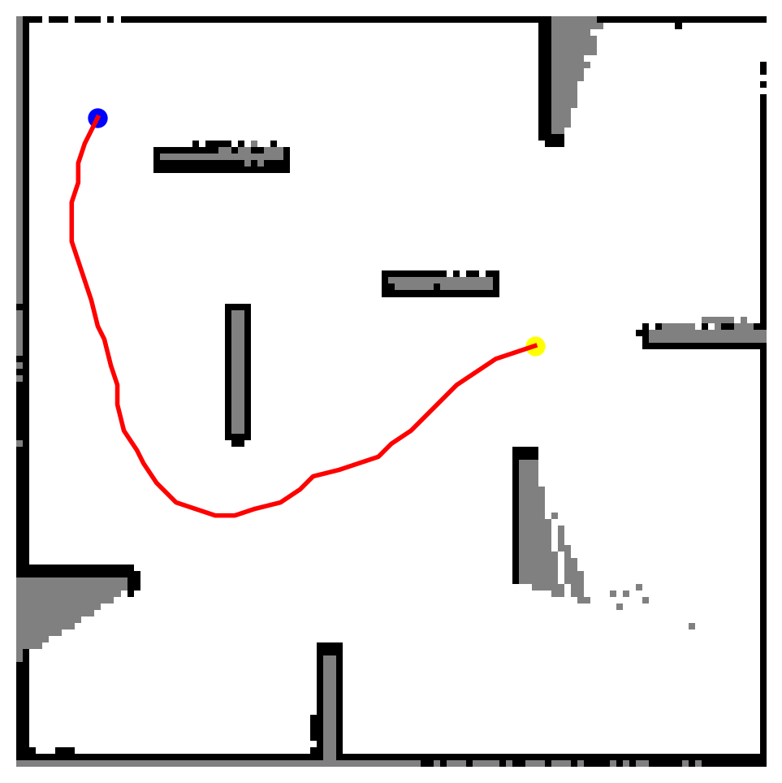
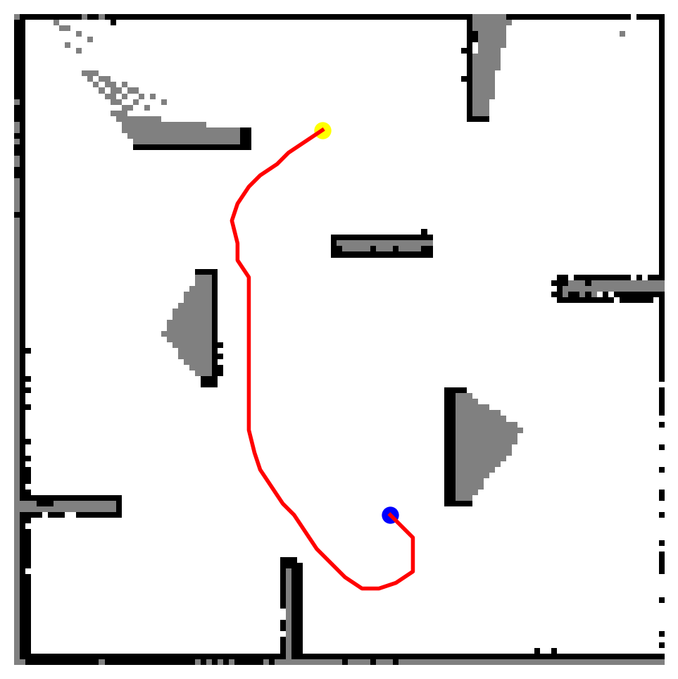
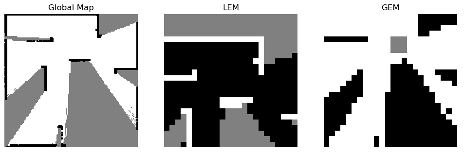
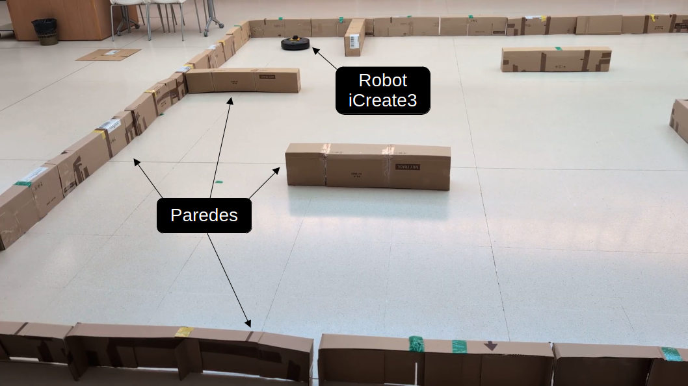

(El repositorio se completará y finalizará próximamente...)

# TFM: Control autónomo de un robot móvil usando ROS2, aprendizaje por refuerzo y SLAM
- Autor: Javier Arambarri Calvo
- Directores: [Raúl Fernández Fernández](https://web.fdi.ucm.es/UCMFiles/pdf/CVs/raufer06.pdf) y [Jesús Chacón Sombría](https://produccioncientifica.ucm.es/investigadores/141395/detalle)
- Máster: [Ingeniería de Sistemas y de Control](https://www.ucm.es/estudios/master-ingenieriadesistemas)
- Universidad: Universidad Complutense de Madrid (UCM)
- Curso: 2025-2026

Este repositorio recoge el Trabajo de Fin de Máster "Control autónomo de un robot móvil usando ROS2, aprendizaje por refuerzo y SLAM"

<!--, que obtuvo una calificación de 10 y Matrícula de Honor y el 1º Premio del eje Prosperidad en el VIII. Congreso de Estudiantes de la Universidad del País Vasco (UPV / EHU).-->

En el directorio principal encontramos:
- ``create3_sim_JavAram/``: directorio con los paquetes de ROS2 Humble para ejecutar la simulación del robot iRobot iCreate3 en Gazebo Classic.
- ``turtlebot3_drlnav_JavAram/``: directorio con los paquetes de ROS2 Humble para ejecutar la arquitectura del agente de aprendizaje por refuerzo, tanto el entrenamiento como la inferencia.
- ``map_proc_ws/``: directorio con el paquete ROS2 ``map_processor`` que contiene el nodo gestor del proceso de SLAM, responsable de reiniciar el mapa entre episodios.
- ``doc/``: directorio con la documentación del proyecto, memoria del TFM e imágenes.
<br><br>

## Contacto
- Mail: javierarambarricalvo@gmail.com
- Redes: [https://linktr.ee/arambarricalvoj](https://linktr.ee/arambarricalvoj)

## Referencias
Todas las referencias están debidamente citadas en la memoria (``doc/memoria.pdf``)

## Fotos y vídeos
Fotos y vídeos disponibles en la carpeta ``doc/img/memoria/``.
 
<div align="center">
  
  
</div>

<div align="center">
  
</div>

<div align="center">
  
</div>

<br><br>

# Ejecución del sistema desarrollado
En esta sección se presentan los pasos y comandos necesarios para ejecutar el repositorio en una máquina Ubuntu 24.04. Se dan por hecho conocimientos previos de Docker, así como su correcta instalación sin necesidad de utilizar el comando ``sudo``.

## 1. Construir la imagen de Docker o descargarla 
Construir (ubicando la terminal en la raíz del repositorio):
```bash
docker build -t tfm_rl:slam_apt .
```

Descargar:
```bash
docker pull arambarricalvoj/tfm_rl:slam_apt
```

Esta imagen Docker incluye todas las dependencias necesarias para ejecutar el sistema completo.
<br><br>

## 2. Ejecutar imagen de Docker
Dar permisos de ejecución al fichero ``run.sh`` (solo la primera vez que se ejecute):
```bash
sudo chmod u+x run.sh
```

Lanzar el contenedor de Docker de la aplicación:
```bash
./run.sh
```

Para acceder al contenedor desde otras terminales:
```bash
docker exec -it tfm_rl bash
```

En las terminales accedidas mediante ``docker exec`` es necesario ejecutar ``source /opt/ros/humble/setup.bash`` y ``source /ros2_ws/install/setup.bash``.
<br><br>

## 3. Ejecutar entrenamiento del agente
Estos comandos se ejecutan dentro del contenedor de Docker en ejecución.

Primero, compilar los paquetes a ejecutar:
```bash
cd /home/$USER/map_proc_ws/
colcon build

cd /home/$USER/create3_ws/
colcon build

cd /home/$USER/turtlebot3_drlnav_ws/
colcon build

cd /home/$USER/
```

Segundo, activar los paquetes compilador:
```bash
source /opt/ros/humble/setup.bash
source /home/$USER/create3_ws/install/setup.bash
source /home/$USER/turtlebot3_drlnav_ws/setup_drlnav.sh
source /home/$USER/turtlebot3_drlnav_ws/install/setup.bash
source /home/$USER/map_proc_ws/install/setup.bash
```

Tercero, crear el fichero con el número de escena correspondiente. Para este proyecto, ``9``;
```bash
touch /tmp/drlnav_current_stage.txt
echo 9 > /tmp/drlnav_current_stage.txt
```

<!--## **Todos los comandos de ejecución tienen que ejecutarse desde ``/home/$USER/``, en mi caso ``/home/javierac/``. Si estamos en esa carpeta, al hacer ``ls`` tendrán que salir los 3 workspaces: ``create3_ws/``, ``map_proc_ws``, ``turtlebot3_drlnav_ws``**-->

A partir de este punto, se abren un total de 5 terminales para lanzar todos los procesos. Todas las terminales tienen que estar dentro del contenedor de Docker y en la ruta ``/home/$USER/``:
```bash
cd /home/$USER/
```

Para gestionar múltiples terminales desde la misma pantalla, se recomienda el uso de Tilix. Para instalarlo ejecutar:
```bash
sudo apt update && sudo apt install tilix -y
```

<br><br>
Terminal 1, lanzar la simulación del robot en Gazebo Harmonic (modo headless, solo interfaz de RViz para visualizar) con el escenario de entrenamiento:
```bash
ros2 launch irobot_create_gazebo_bringup create3_gazebo.launch.py world_path:=/home/$USER/create3_ws/src/irobot_create_gazebo/irobot_create_gazebo_bringup/launch/worlds/stage9.model use_gazebo_gui:=false
```

Si se desea que el robot aparezca en la esquina superior derecha, por ejemplo:
```bash
ros2 launch irobot_create_gazebo_bringup create3_gazebo.launch.py     world_path:=/home/$USER/create3_ws/src/irobot_create_gazebo/irobot_create_gazebo_bringup/launch/worlds/stage9.model use_gazebo_gui:=false x:=2.25 y:=2.25 z:=0.01 yaw:=-1.57
```

Si se desea arrancar el escenario con objetos dinámicos que se desplazan automáticamente por la estancia simulada, sustituir la ruta de ``world_path`` por:
```bash
/home/javierac/create3_ws/src/irobot_create_gazebo/irobot_create_gazebo_bringup/launch/worlds/stage9-obstacle-javi.model
```
<br><br>

Terminal 2, lanzar el gestor de SLAM:
```bash
ros2 run map_processor reset_slam
```
<br><br>

Una vez arrancada correctamente la simulación y el proceso de SLAM, continuamos con las ejecuciones.
<br><br>

Terminal 3, lanzar el entorno del sistema:
```bash
ros2 run turtlebot3_drl environment
```
<br><br>

Terminal 4, lanzar el entrenamiento del agente:
```bash
ros2 run turtlebot3_drl train_agent td3
```
<br><br>

Terminal 5, lanzar el gestor de Gazebo:
```bash
ros2 run turtlebot3_drl gazebo_goals
```
<br><br>

En caso de querer inferenciar cuando el entrenamiento iba por 7.000 episodios:
```bash
ros2 run turtlebot3_drl test_agent td3 td3_13_stage_9 7000
```

## Inferencia
Una vez entrenado el agente, para ejecutar su inferencia, sustituir el comando de la Terminal 4 por:
```bash
ros2 run turtlebot3_drl test_agent td3 <nombre_dir> <num_episodio>
```

Por ejemplo, si el modelo se ha guardado en ``/home/javierac/Documents/ucm/TFM-PFM/tfm_rl/turtlebot3_drlnav_JavAram/src/turtlebot3_drl/model/localhost.localdomain/td3_13_stage_9`` (revisar el output de la Terminal 4) y se han entrenado hasta 12.000 episodios:
```bash
ros2 run turtlebot3_drl test_agent td3 td3_13_stage_9 12000
```

# Robot Real

Terminal 1 (Raspberry Pi - no docker) - Run RPLIDAR + tf LIDAR-Robot:
```bash
# Connect to Raspbery Pi (recommended to use ssh)
cd ros2_ws
./launch_slam.sh
```

Terminal 2 (Raspberry Pi - no docker) - Node to transform scan to a fixed 500 samples:
```bash
# Connect to Raspbery Pi (recommended to use ssh)
python3 scan_resampler.py
```

Terminal 3 - Run RL Environment:
```bash
# Run first source commands as indicated above
touch /tmp/drlnav_current_stage.txt
echo 9 > /tmp/drlnav_current_stage.txt
export ROS_DOMAIN_ID=0
ros2 run turtlebot3_drl real_environment
```

Terminal 4 - SLAM:
```bash
# Run first source commands as indicated above
cd /home/$USER/
export ROS_DOMAIN_ID=0
ros2 run slam_toolbox async_slam_toolbox_node   --ros-args   --params-file /home/raul/create3_ws/src/irobot_create_common/irobot_create_common_bringup/config/mapper_params_online_async.yaml   -p use_sim_time:=false   -r /tf:=/vin/tf   -r /tf_static:=/vin/tf_static
```

Terminal 5 - Policy:
```bash
# Run first source commands as indicated above
export ROS_DOMAIN_ID=0
ros2 run turtlebot3_drl real_agent td3 'td3_19_stage_9' 5300
```

Terminal X (Optional) - Rviz:
```bash
# Run first source commands as indicated above
export ROS_DOMAIN_ID=0
ros2 run rviz2 rviz2 -d /home/raul/rviz-config-real.rviz --ros-args -r /tf:=/vin/tf -r /tf_static:=/vin/tf_static
```

Terminal Y (Optional) - Teleoperate movement:
```bash
# Run first source commands as indicated above
export ROS_DOMAIN_ID=0
ros2 run teleop_twist_keyboard teleop_twist_keyboard --ros-args -r cmd_vel:=/vin/cmd_vel
```
